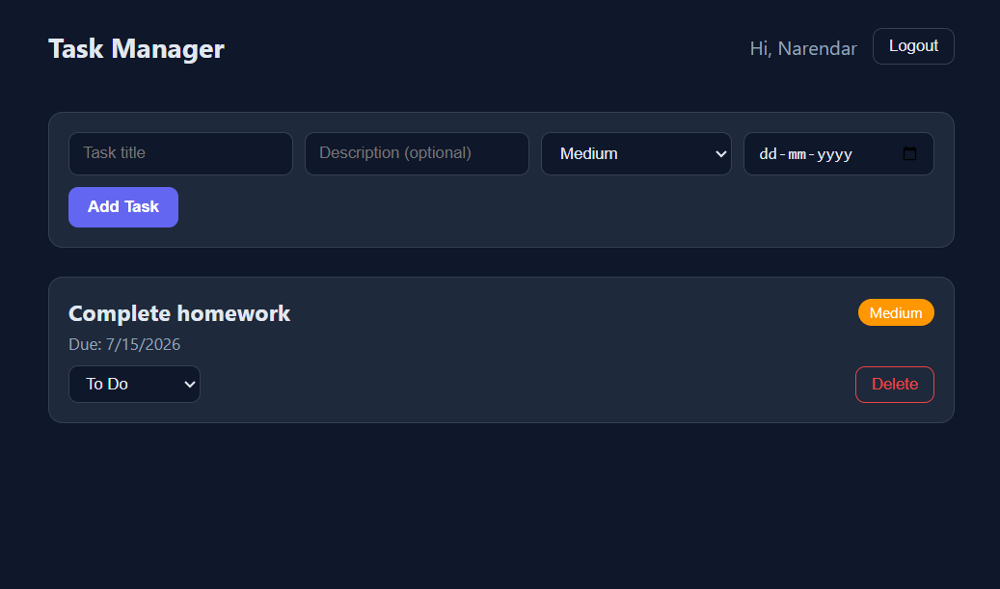

# Task Manager — MERN Stack

A full-stack task management app with JWT authentication, built to demonstrate core MERN (MongoDB, Express, React, Node.js) skills: secure auth, protected REST APIs, and a clean React frontend consuming them.

**Live demo:** https://task-manager-tau-five-83.vercel.app/

**Backend API:** https://taskmanager-5zjc.onrender.com/

> Note: the backend is hosted on Render's free tier, which sleeps after inactivity. The first request after idle can take 30-50 seconds to respond — please allow it a moment to wake up.

---

## Screenshot



---

## Features

- **Authentication:** Register/login with JWT, passwords hashed with bcrypt
- **Task management:** Create, update status, and delete tasks
- **Per-user data scoping:** Every task is tied to its owner and enforced at the API level, not just the UI
- **Task metadata:** Priority (low/medium/high), status (todo/in-progress/done), optional due dates
- **Protected routes:** Both frontend routes and backend endpoints require a valid token

## Tech Stack

| Layer    | Technology                                                    |
| -------- | ------------------------------------------------------------- |
| Frontend | React (Vite), React Router, Axios                             |
| Backend  | Node.js, Express                                              |
| Database | MongoDB (Atlas), Mongoose                                     |
| Auth     | JSON Web Tokens, bcrypt                                       |
| Hosting  | Vercel (frontend), Render (backend), MongoDB Atlas (database) |

## Architecture

```
React (Vercel) ──HTTP──▶ Express API (Render) ──Mongoose──▶ MongoDB Atlas
     │                          │
  JWT stored in           JWT verified via
  localStorage             middleware on
                            every request
```

- Frontend sends credentials to `/api/auth/login` or `/api/auth/register`, receives a JWT, and stores it in `localStorage`.
- Every subsequent request attaches the JWT as a `Bearer` token via an Axios interceptor.
- Backend middleware (`middleware/auth.js`) verifies the token and attaches the authenticated user to `req.user` before any task route runs.
- Every task query/mutation is filtered by `req.user._id`, so users can only ever see or modify their own data — enforced server-side, not just hidden in the UI.

## Project Structure

```
mern-task-manager/
├── backend/
│   ├── config/db.js
│   ├── controllers/       # business logic for auth & tasks
│   ├── middleware/auth.js # JWT verification
│   ├── models/            # Mongoose schemas (User, Task)
│   ├── routes/
│   └── server.js
└── frontend/
    └── src/
        ├── api/axios.js       # Axios instance with token interceptor
        ├── context/AuthContext.jsx
        ├── components/
        └── pages/
```

## Running Locally

**Backend**

```bash
cd backend
npm install
npm run dev
```

**Frontend**

```bash
cd frontend
npm install
npm run dev
```

## What I'd Add Next

- Refresh tokens instead of a single long-lived JWT
- Filtering/search on the task list (by status, priority, due date)
- Pagination for larger task lists
- A cron-based uptime ping to avoid Render's free-tier cold starts

---
